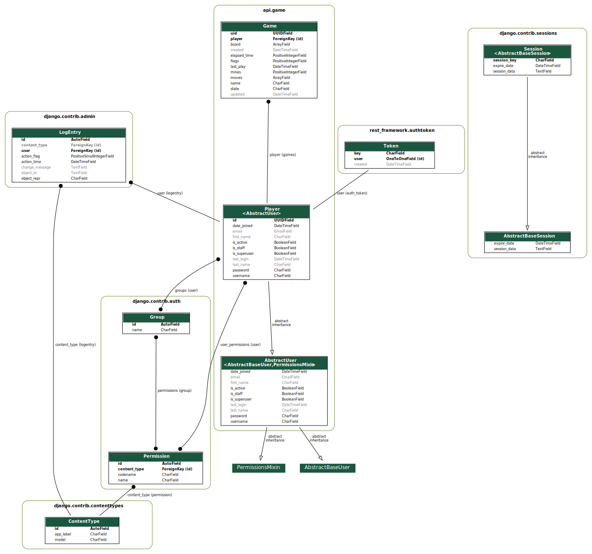

# minesweeper-API
API test

You can watch the original [README](https://github.com/deviget/minesweeper-API/blob/master/README.md)

## RESUME

### Requirements
- Python 3.7
- Django
- Postgres 11.+
- Docker
- Docker-Compose
- CircleCI
- Postman

### Current state
- The application allows you to create player accounts.
- You can create a new game and list all the games by player.
- Show a cell or mark with a flag the cells.
- Pause and resume a game.
- Restart a current game.
- The API rest is running on `http://devtest.bid`
- See the endpoins documentation [here](https://documenter.getpostman.com/view/110139/S1ZxdWCF)

### Database model

### TODO:
- Develop a set of unit test to eval some use case.
- Build a SPA application to test the game

